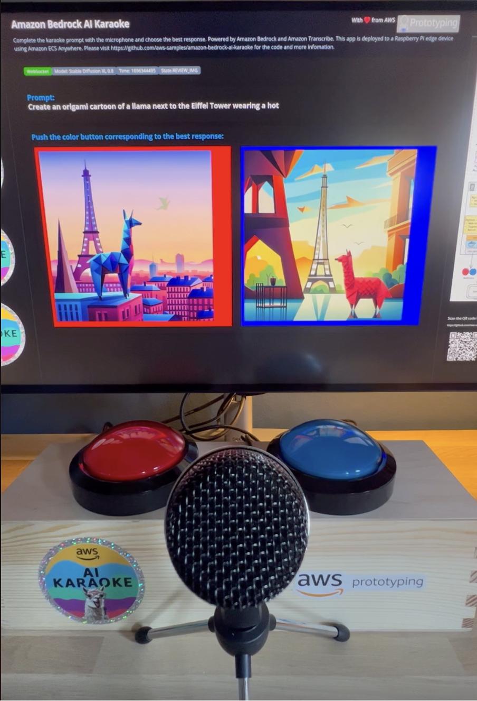
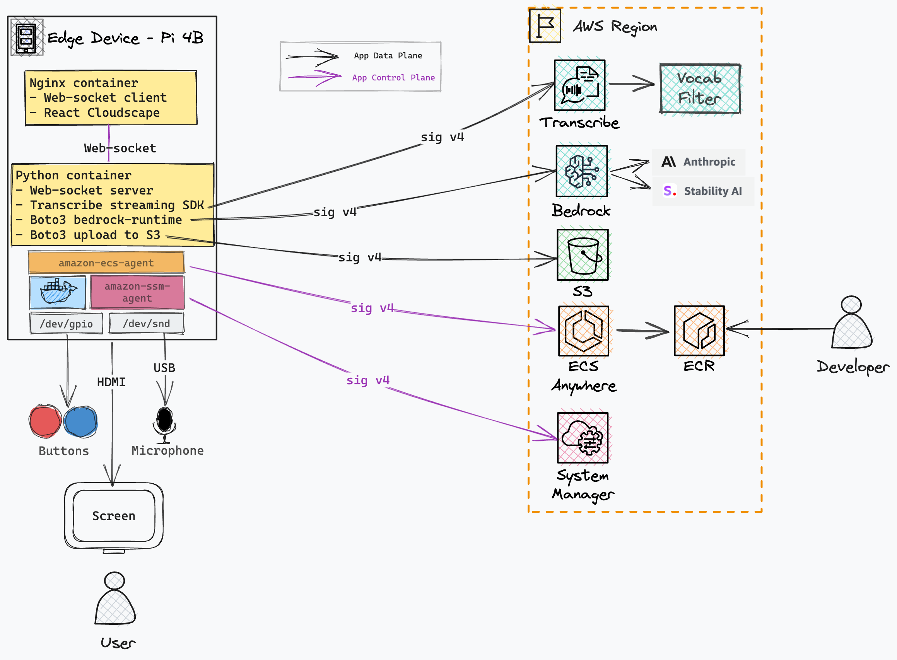
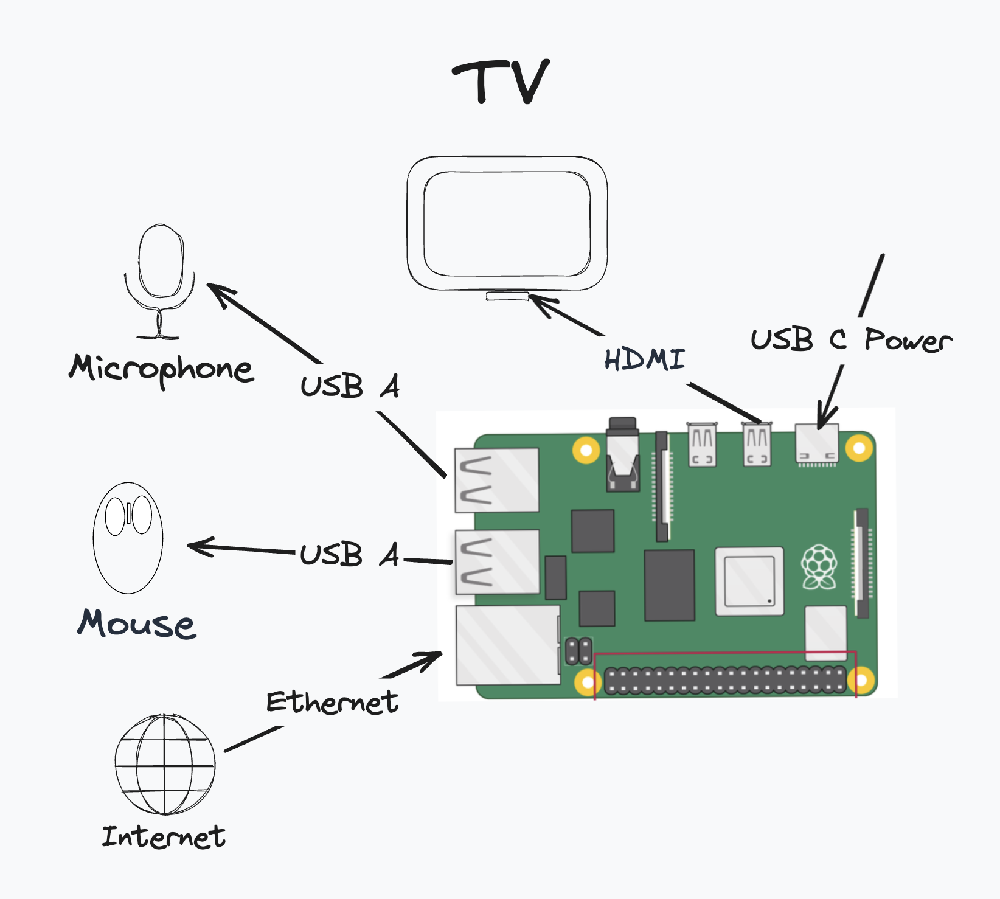
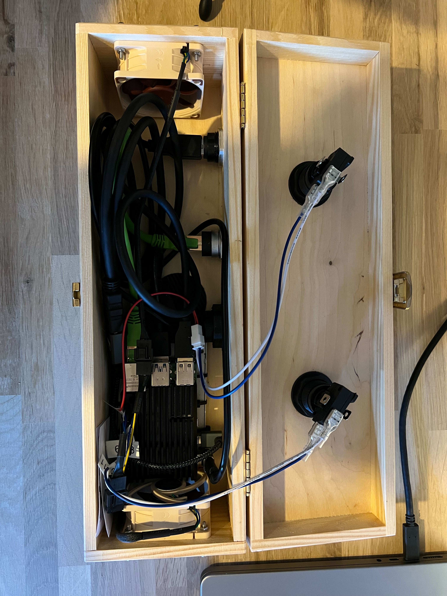

# Amazon Bedrock AI Karaoke
[](https://github.com/aws-samples/amazon-bedrock-ai-karaoke/releases)
[](https://star-history.com/#aws-samples/amazon-bedrock-ai-karaoke)
[](https://opensource.org/licenses/MIT)


Amazon Bedrock AI Karaoke is an interactive demo of prompting foundation models with a microphone and asking a human to pick their preferred response.


# Table of content
- [Motivation](#motivation)
- [User Instructions](#user-instructions)
- [Architecture](#architecture)
- [Local Dev](#local-dev)
- [Deploy to Pi](#deploy-to-pi)
- [Troubleshooting](#troubleshooting)
- [Vocab Filter](#vocab-filter)
- [BOM](#bom)
- [Build instructions](#build-instructions)

# Motivation
Firstly, this is meant to be fun! Getting people to interact through a microphone and big push-buttons makes this demo more suitable for summits and demo spaces and resonates with non-technical audiences.



Secondly, this introduces customers to several key ideas in state-of-the-art GenAI system engineering including:

1) The anatomy of a prompt
2) Intuition for the data flywheel from human feedback
3) Mitigating challenges of hallucination and safety

# User Instructions
1) 🎤 Pickup the microphone
2) 🕺 Complete the prompt - Karaoke style!! Speak clearly and close to the mic.
3) 🔴 🔵 Review the completions and push the color button corresponding to the best answer
4) 🔁 Repeat! There are a different prompt templates to play with.

# Architecture


The key AWS services used in this architecture are:

- [Amazon Bedrock]("https://aws.amazon.com/bedrock/") is used for generation from fully managed foundation models (FMs) from leading AI companies like AI21 Labs, Anthropic, Cohere, Meta, Stability AI, and Amazon via a single API.
- [Amazon Transcribe Streaming]("https://docs.aws.amazon.com/transcribe/latest/dg/streaming.html") Is used with the python [Amazon Transcribe Streaming SDK]("https://github.com/awslabs/amazon-transcribe-streaming-sdk") to produce real-time transcriptions from the microphone audio stream. [Vocabulary Filters]("https://docs.aws.amazon.com/transcribe/latest/dg/vocabulary-filtering.html") are used to remove unwanted words during the transcription, before they get to the prompt.
- [Amazon ECS Anywhere]("https://aws.amazon.com/ecs/anywhere/") is a feature of Amazon ECS that lets you run and manage container workloads on your infrastructure. In this case we use a Raspberry Pi device at the edge.
- [Amazon ECR]("https://aws.amazon.com/ecr/") is a fully managed container registry. It's used to version and host the application containers which are pulled onto the edge device.
- [Amazon S3]("https://aws.amazon.com/s3/") is object storage built to retrieve any amount of data from anywhere. We use S3 to store a record of the generations and human preferences so they can be used in the future for evaluation and fine-tuning.
- [AWS Cloud Development Kit]("https://aws.amazon.com/cdk/") is an infrastructure as code tool that allows you to define your cloud application resources using familiar programming languages.
- [AWS Identity and Access Management]("https://aws.amazon.com/iam/") allows you to securely manage identities and access to AWS services and resources.

# Prerequisites

1. Get the code 

	```bash
	git clone https://github.com/aws-samples/amazon-bedrock-ai-karaoke
	```

2. Ensure you have AWS credentials configured
3. To interact with models from Amazon Bedrock, you need to [request access to the base models in one of the regions where Amazon Bedrock is available](https://console.aws.amazon.com/bedrock/home?#/modelaccess). Make sure to read and accept models end-user license agreements or EULA.


# Local Dev
To get started with this project, it's recommended to first try it out locally on your laptop.

Firstly, we will install and run the front-end website locally:

1. Move to the website src directory 
	```bash
	cd ./lib/client/
	```
2. Install the npm dependencies 
	```bash
	npm install
	```
3. Run the website 
	```bash
	npm start
	```
4. Open a browser and go to http://localhost:3000


Now, in another terminal - we will started the server application

1. Move to the server src directory: 
	```bash
	cd ./lib/server/
	```
2. Install the python dependencies: (note the RPi.GPIO install will fail on your laptop but this is expected)
	```bash
	pip install -r requirements.txt
	```
3. Run the server: 
	```bash
	python3 server.py
	```

# Deploy to Pi

Once you have tried the application locally, you may choose to deploy it to a Raspberry Pi device with orchestration in the cloud so you can leave the demo running at an event. There are several benefits to this approach of using Amazon ECS Anywhere including:

- Standardised container packaging of app and dependencies
- Centralised cloud controlled software updates
- Centralised cloud logging and monitoring
- Finely scoped temporary credential management at the edge

The following commands show how to package and deploy the application as an AWS CDK application.

First, complete the following pre-requisites:
1. Install the Raspberry Pi OS (64 Bit) with GUI using [Raspberry Pi Imager](https://www.raspberrypi.com/software/) to your Raspberry Pi and setup SSH keys and internet.
2. Power up and SSH to the pi

Now it's time to configure the infrastructure to deploy the software to the Raspberry Pi:

1. Get the code 
	
	```bash
	git clone https://github.com/aws-samples/amazon-bedrock-ai-karaoke
	```

2. Your AWS account and Region must be [bootstrapped]("https://docs.aws.amazon.com/cdk/v2/guide/bootstrapping.html") to create these resources before you can deploy. If you haven't already bootstrapped, issue the following command: 
	```bash
	cdk bootstrap aws://ACCOUNT-NUMBER/REGION
	```
3. Deploy the cdk app
	```bash
	cdk deploy
	```
4. When the deployment is paused on the ECS Service creation, login to the AWS Console to get the registration command: https://docs.aws.amazon.com/AmazonECS/latest/developerguide/ecs-anywhere-registration.html
5. SSH onto the raspberry pi and paste the registration command
6. The deployment should now complete and the service should be running on the pi
7. Setup the kiosk service. You can find the `kiosk.sh` and `kiosk.service` files in the top level `scripts` directory.

	```
	sudo apt install xdotool unclutter
	sudo raspi-config > 1 System Options > S5 Boot / Auto Login >B4 Desktop Autologin — Desktop GUI, automatically logged in as ‘pi’ user
	```
	Create the following files and enable the kiosk service
	```
	vim /home/pi/kiosk.sh
	sudo vim /lib/systemd/system/kiosk.service
	sudo systemctl enable kiosk.service
	sudo systemctl start kiosk.service
	```

8. Either build the full hardware box following the [Build Instructions](#build-instructions) or use the minimal pi setup and use a USB mouse instead of the buttons to select the best response:

	


# Troubleshooting
If UI scaling is wrong then first try to correct it from the TV settings. If that fails, try the following:

1. Connect a USB keyboard to an available slot
2. Press `Ctr + ` to increase the zoom and  `Ctr - ` to decrease the zoom

* Sometimes it takes the containers a while to start - please wait 5mins or so. If still nothing then try rebooting. I have seen issues with the ECS agent starting dues to the way it caches credentials when hard-reset so sometimes another reboot helps
* Transcribe timeout errors after 15 seconds. This tends to happen when there is a poor internet connection. Try changing to wired if using wifi.
* In general, errors clear and the main process restarts after 20 seconds.

# Vocab Filter
You can add more bad words to mask in the prompt by appending to the `lib/server/profanity.txt` file. Please note the requirements and limits listed [here](https://docs.aws.amazon.com/transcribe/latest/dg/vocabulary-filter-create.html) when adding words to the list.

# BOM
- Raspberry Pi 4B 4GB (£55) - https://thepihut.com/products/raspberry-pi-4-model-b
- PSU (£9) - https://thepihut.com/products/raspberry-pi-psu-uk 
- Standard SD Card OR SSD hard drive and SATA cable (~£20) - https://www.amazon.co.uk/gp/product/B01N6JQS8C/ and https://thepihut.com/products/ssd-to-usb-3-0-cable-for-raspberry-pi
- Heat sink case (£8) - https://shop.pimoroni.com/products/aluminium-heatsink-case-for-raspberry-pi-4?variant=29430673178707
- USB Mic (£20) - https://www.amazon.co.uk/gp/product/B08GYMT6BT
- USB A plug (£17) - https://www.amazon.co.uk/gp/product/B0C81FMD8M/ref=ppx_yo_dt_b_asin_title_o08_s00?ie=UTF8&psc=1
- USB C right angle connector (£3) - https://www.amazon.co.uk/gp/product/B0B8X6H96S/ref=ppx_yo_dt_b_asin_title_o09_s00?ie=UTF8&psc=1
- HDMI right angle connector (£10) - https://www.amazon.co.uk/gp/product/B0BBYV12N3/ref=ppx_yo_dt_b_asin_title_o00_s00?ie=UTF8&psc=1
- USB C & HDMI plug - https://www.amazon.co.uk/gp/product/B0BYJ2WTY5/ref=ppx_yo_dt_b_asin_title_o00_s00?ie=UTF8&psc=1
- RJ45 plug (£16) - https://www.amazon.co.uk/gp/product/B0BRFP889X/ref=ppx_yo_dt_b_asin_title_o04_s00?ie=UTF8&psc=1
- Fan filter covers (£7) - https://www.amazon.co.uk/gp/product/B0BWNDXFGY/ref=ppx_yo_dt_b_asin_title_o01_s00?ie=UTF8&psc=1
- 60mm PWM fans x2 (£30) - https://www.amazon.co.uk/gp/product/B00VXTANZ4/ref=ppx_yo_dt_b_asin_title_o02_s00?ie=UTF8&psc=1 
- 25cm ethernet patch (£5) - https://www.amazon.co.uk/gp/product/B08572JJ26/ref=ppx_yo_dt_b_asin_title_o04_s00?ie=UTF8&psc=1
- Wine gift box (£15) - https://www.amazon.co.uk/gp/product/B07CY12Q5R/ref=ppx_yo_dt_b_asin_title_o00_s00?ie=UTF8&th=1
- Massive red button (£9) - https://thepihut.com/products/massive-arcade-button-with-led-100mm-red
- Massive blue button (£9) - https://thepihut.com/products/massive-arcade-button-with-led-100mm-blue
- Button wires (£2) - https://thepihut.com/products/arcade-button-and-switch-quick-connect-wires-0-25-10-pack
- JST-XH Extension Cable (£2) - https://thepihut.com/products/jst-xh-extension-cable-2-5mm-pitch-500mm-long
- 4x M3x15 bolts and nuts to connect the fans to the box
- Velcro strip to hold the pi to the floor of the box

Total ~ £250

### Tools used
- Drill and attachments
- Screwdrivers
- Dupoint crimping tool - https://www.amazon.co.uk/gp/product/B07QNPZDTW

# Build instructions
Work in progress

- Flash SSD or SD card with Raspberry Pi OS (64 Bit) using Raspberry Pi Imager
	- Click settings to set hostname, key authentication etc: https://www.raspberrypi.com/software/



## Raspberry pi pin-out

| Wire              | Pin Number | Pin Name |
| ----------------- | ---------- | -------  |
| Red button COM1   | 36         | GPIO 16  |
| Red button NO3    | 34         | Ground   |
| Blue button COM1  | 11         | GPIO 17  |
| Blue button NO3   | 9          | Ground   |
| Fan 1 5V (Yellow) | 4          | 5V       |
| Fan 1 GND (Black) | 6          | Ground   |
| Fan 1 PWM (Blue)  | 8          | GPIO 14  |
| Fan 2 5V (Yellow) | 2          | 5V       |
| Fan 2 GND (Black) | 39         | Ground   |
| Fan 2 PWM (Blue)  | 37         | GPIO 26  |

Optionally, you can also connect the LED connectors on the buttons to the two spare 3V3/GND pins.

| Wire              | Pin Number | Pin Name |
| ----------------- | ---------- | -------  |
| Red button LED    | 17         | 3V3      |
| Red button GND    | 25         | Ground   |
| Blue button LED   | 1          | 3V3      |
| Blue button GND   | 20         | Ground   |


## De-registering external instances
This is useful if you need to re-register the raspberry pi to a different ECS cluster

https://docs.aws.amazon.com/AmazonECS/latest/developerguide/ecs-anywhere-deregistration.html

```
sudo systemctl stop ecs amazon-ssm-agent
sudo apt remove -y amazon-ecs-init amazon-ssm-agent
sudo rm -rf /var/lib/ecs /etc/ecs /var/lib/amazon/ssm /var/log/ecs /var/log/amazon/ssm
```

# Delete ECS checkpoint to avoid creds bug
https://github.com/aws/amazon-ecs-agent/blob/master/agent/app/agent.go#L783-L798

sudo vim  /etc/rc.local

rm /var/lib/ecs/data/ecs_agent_data.json

# Second WiFi on Pi
```bash
sudo vim /etc/wpa_supplicant/wpa_supplicant.conf 
```

```
network={
	ssid=""
	psk=""
}
```

## Security

See [CONTRIBUTING](CONTRIBUTING.md#security-issue-notifications) for more information.

## License

This library is licensed under the MIT-0 License. See the LICENSE file.

